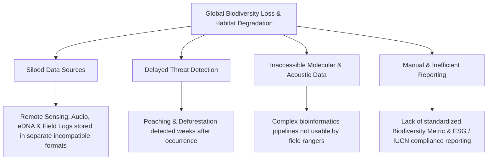
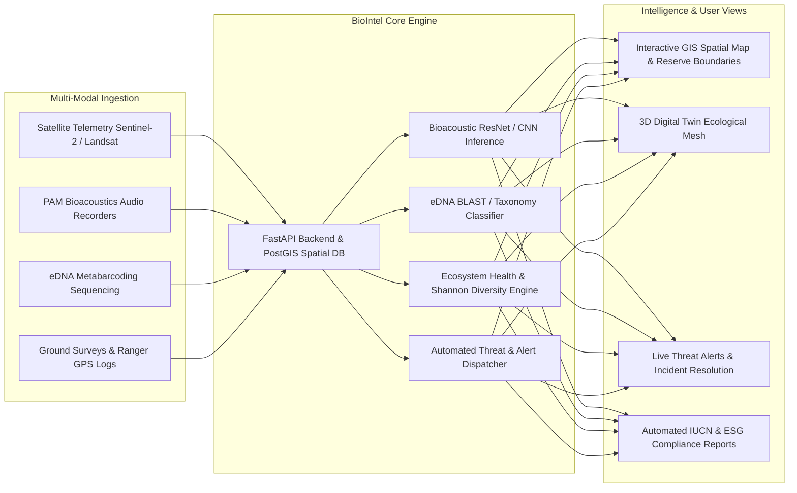
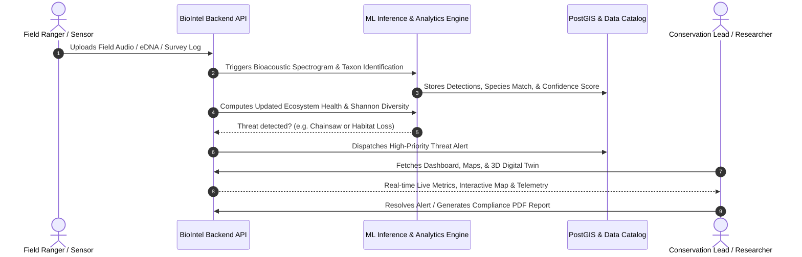

# BioIntel — AI-Powered Biodiversity Intelligence & Ecological Monitoring Platform

## 1. Executive Summary & Overview

**BioIntel** is an enterprise-grade, multi-modal ecological intelligence platform designed for conservation biologists, reserve rangers, environmental researchers, and policymakers. It fuses satellite remote sensing, passive bioacoustics, environmental DNA (eDNA) metabarcoding, and on-ground field observations into a unified real-time spatial digital twin. Powered by machine learning and geospatial analytics, BioIntel enables early threat detection (poaching, illegal logging, invasive species outbreaks) and automates ecosystem health index accounting.

---

## 2. The Problem

Modern ecosystem management and wildlife conservation face several critical operational bottlenecks:

1. **Fragmented, Multi-Modal Data Silos**:
   - Satellite imagery (NDVI, canopy density, surface temperatures), field bioacoustics (PAM recordings), eDNA sequencing reads, and ranger field logs reside in disparate tools and spreadsheets with no single pane of glass.
2. **Delayed Threat Detection & Slow Response**:
   - Deforestation, wildfire encroachment, chainsaws, gunshot acoustic spikes, and unauthorized reserve intrusions are frequently identified weeks after damage has already occurred.
3. **Bioinformatics & ML Pipeline Complexity**:
   - Processing raw bioacoustic spectrograms or metabarcoding read taxonomies requires complex command-line bioinformatic tools out of reach for on-the-ground park authorities.
4. **Lack of Continuous Quantitative Health Metrics**:
   - Traditional biodiversity surveys occur once every several years, making it impossible to evaluate high-frequency ecological fluctuations, climate stress impacts, or habitat degradation trends in real time.

---

## 3. The Solution

**BioIntel** solves these challenges by combining **multi-source ingestion, real-time ML inference, spatial GIS analysis, and 3D digital twinning**:

1. **Unified Multi-Modal Spatial Data Fusion**:
   - Standardizes satellite canopy indices (NDVI, EVI, NDRE), audio audio spectrograms, eDNA sample assays, and GBIF field records under a PostGIS geospatial coordinate system.
2. **AI-Driven Acoustic & Genomic Classifiers**:
   - Employs deep learning audio classifiers for instant species call identification and confidence scoring.
   - Parses eDNA sequence reads to calculate read frequencies, OTUs (Operational Taxonomic Units), and community composition.
3. **Continuous Ecosystem Health Index & Shannon Entropy**:
   - Dynamically calculates the **Ecosystem Health Index** ($H_{index}$) and **Shannon-Wiener Diversity Index** ($H'$) from multi-spectral canopy health and species richness distributions.
4. **Proactive Real-Time Early Warning System**:
   - Dispatches automated severity alerts (`Critical`, `High`, `Medium`) for acoustic threats (chainsaws, gunshots), deforestation alerts, and invasive species outbreaks.
5. **Interactive 3D Digital Twin & GIS Mapping**:
   - Renders 3D terrain meshes with real-time sensor node telemetry, environmental layers, and live site health monitoring.

---

## 4. End-to-End Workflow

### Detailed Workflow Stages:

1. **Data Acquisition & Ingestion**:
   - **Satellite Remote Sensing**: Ingests Sentinel-2 MSI multi-spectral surface reflectance imagery, calculating NDVI, EVI, NDRE, canopy coverage percentage, and surface temperature.
   - **Passive Acoustic Monitoring (PAM)**: Field recording devices continuously capture wildlife soundscapes and store frequency ranges (Hz), duration, and audio wave files.
   - **eDNA Metabarcoding**: Ingests water/soil environmental DNA sequence assays, marker genes (12S, 16S, COI, ITS), and OTU abundance tables.
   - **Ground Surveys**: Field rangers record direct sightings, tracks, and GPS-tagged observations.

2. **Automated ML Processing & Analytical Fusion**:
   - **Acoustic Inference Engine**: Analyzes sound wave frequencies and durations to classify species vocalizations with model confidence percentages.
   - **Shannon-Wiener Biodiversity Index ($H'$)**:
     $$H' = -\sum_{i=1}^{R} p_i \ln(p_i)$$
     Quantifies species richness and evenness across time periods.
   - **Ecosystem Health Index ($0 - 100$)**:
     $$\text{Health Index} = (\text{Mean NDVI} \times 60) + \left(\frac{\text{Canopy Cover \%}}{100} \times 40\right)$$

3. **Threat Detection & Automated Dispatch**:
   - Monitors threshold triggers (e.g., sudden drop in canopy coverage, bioacoustic anomalies, invasive species detection).
   - Generates actionable alerts with geo-coordinates, severity level, affected site, and recommended response procedures.

4. **Visualization, Digital Twin & Reporting**:
   - **Map Explorer**: Interactive GIS layer with protected reserve boundaries, sensor nodes, and heatmaps.
   - **3D Digital Twin**: Interactive 3D terrain model visualizing sensor telemetry, surface heat distribution, and vegetative stress.
   - **Reporting & Compliance**: Generates exportable ecological health summaries and IUCN Red List distribution reports for biodiversity audits.

---

## 5. Technology Stack & Architecture

| Tier | Technologies | Purpose |
|---|---|---|
| **Frontend UI** | **React 18, Vite, Tailwind CSS, Lucide Icons** | High-performance dashboard with glassmorphism UI and responsive layouts |
| **Data Visualization** | **Recharts, Lucide React, Canvas / SVG** | Multi-modal timeseries, Shannon entropy curves, condition breakdowns |
| **Spatial & 3D Digital Twin** | **Leaflet, MapLibre, Three.js / WebGL** | Geospatial GeoJSON boundary visualization and 3D terrain twin simulation |
| **Backend API** | **Python 3.11+, FastAPI, Uvicorn, Pydantic v2** | High-throughput asynchronous REST API endpoints with auto OpenAPI docs |
| **Spatial Database & ORM** | **PostgreSQL, PostGIS, SQLAlchemy 2.0, Alembic** | Geospatial queries, coordinate indexing, and relational data persistence |
| **Data Processing & ML** | **Pandas, NumPy, PyTorch / Librosa, Scikit-learn** | Analytical aggregation, statistical diversity computation, acoustic ML |

---

## 6. Functional Modules in BioIntel

1. **Dashboard & Live Analytics**: Real-time summary cards, 7-day biodiversity trend charts, dataset distribution breakdowns, and recent threat streams.
2. **Spatial GIS Explorer**: Interactive map displaying all 8 major conservation reserves, telemetry pins, and alert zones.
3. **Species Catalog**: Multi-class taxonomic catalog covering 65+ species with IUCN Red List statuses (CR, EN, VU, NT, LC), bio-indicator tags, and verified wildlife photography.
4. **Passive Acoustic Monitoring (PAM)**: Bioacoustic waveform analyzer and interactive ML species call predictor.
5. **eDNA Metabarcoding**: Molecular sample tracking, primer marker assays, and OTU relative abundance visualizer.
6. **Remote Sensing & Canopy Analytics**: Multi-year satellite time-series monitoring NDVI, EVI, surface temperature, and canopy loss alerts.
7. **Ground Surveys & GPS Sightings**: Field observation recording with coordinates, observer metadata, and verification statuses.
8. **3D Ecological Digital Twin**: Interactive 3D mesh model with live node telemetry and temperature profiles.
9. **Threat Alerts & Incident Dispatch**: Comprehensive triage center for investigating and resolving ecological threats.
10. **Analytics & Diversity Indices**: Multi-modal data bandwidth, Shannon-Wiener entropy, and Simpson index tracking.
11. **Reports & Environmental Auditing**: Automated PDF/CSV export for government conservation reports and ESG compliance.
12. **Data Upload Center**: Ingestion portal for audio WAVs, eDNA FASTQ/CSV tables, satellite imagery, and shapefiles.
13. **User & Role-Based Access Control (RBAC)**: Fine-grained permissions for Rangers, Researchers, and Reserve Administrators.
14. **System Settings & Telemetry API Configuration**: Management of sensor polling rates, API integrations, and backup configurations.
