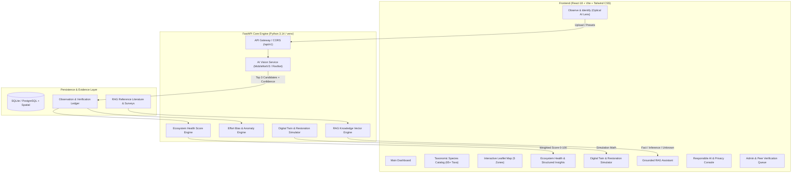

# 🌿 BioIntel

## AI-Powered Biodiversity Monitoring & Ecosystem Health Insights
> **Tagline**: *Observe → Understand → Protect*  
> **Global Goal**: **UN SDG 15 (Life on Land)** — Targets 15.1, 15.5, and 15.9  
> **Initiative**: 1M1B Virtual Internship in collaboration with IBM SkillsBuild & AICTE  
> **Target Biosphere**: College Campus Biodiversity Ledger (5 Campus Ecological Zones)

---

## 🧭 Executive Summary: *From Image to Ecosystem Insight*

Biodiversity monitoring in institutional and urban settings often suffers from fragmented data collection: community sightings remain isolated photos without ecological context, while conservation decisions lack real-time indicators.

**BioIntel** bridges this gap by transforming raw field observations into actionable ecosystem intelligence through an end-to-end multi-modal pipeline:

```
[Photo / Observation]
       │
       ▼
[AI Vision Inference] ──> Top 3 Likely Species Candidates + Confidence Calibration + Warnings
       │
       ▼
[Observation Ledger] ──> Human-in-the-Loop Review Queue (Student/Botanist Verification)
       │
       ▼
[Environmental Fusion] ──> Temperature, Humidity, Soil, Canopy, Rainfall Context
       │
       ▼
[Ecosystem Health Engine] ──> BioIntel Health Score (78/100, 5-Component Transparent Formula)
       │
       ▼
[Anomaly & Threat Detection] ──> Invasive Weeds, Heat Stress, Runoff, Effort Bias Aware
       │
       ▼
[RAG AI Assistant] ──> Grounded Answers with [Observed Fact], [Inference], [Unknown] & Citations
       │
       ▼
[Actionable Conservation] ──> 'What-if' Restoration Simulator + Institutional Audit Reports
```

---

## 🏛️ System Architecture



---

## 🎯 Key Features & Modules

### 1. 📷 Observe & Identify (Optical AI Lens)
- Field observation capture with drag & drop photo upload and demo preset cards (*Indian Peafowl, Common Mormon Butterfly, Banyan Tree, Common Myna*).
- Multi-class vision model returns **Top 3 likely species candidates** with confidence percentages.
- **Confidence Calibration**: Classifications below 70% automatically display a prominent *"Requires field verification"* warning.
- Habitat and Campus Zone selector with instant ledger persistence.

### 2. 🦋 Taxonomic Species Catalog (65+ Taxa)
- Multi-class database across **Birds, Butterflies, Plants, Insects, Reptiles, and Mammals**.
- Filter by Taxonomic Group, Search by Common/Scientific name, and IUCN Red List category (*CR, EN, VU, NT, LC*).
- Interactive species detail drawer showing ecological niche, seasonality, and campus distribution.

### 3. 🗺️ Interactive Ecosystem Map (Leaflet GIS)
- Visualizes the **5 College Campus Biosphere Zones**:
  - *Zone A — Botanical Garden (3.2 ha)*: Medicinal flora, pollinator haven, Health: 86.4
  - *Zone B — Lotus Pond & Wetland (2.1 ha)*: Freshwater reeds, dragonflies, Health: 79.2
  - *Zone C — Central Lawn & Meadows (4.8 ha)*: Open grass, squirrels, mynas, Health: 68.1
  - *Zone D — Dense Woodland & Arboretum (6.5 ha)*: Forest refuge, raptors, Health: 88.7
  - *Zone E — Academic & Built Area (5.2 ha)*: Urban adapted species, Health: 62.3
- **Interactive Sensitive Species Privacy Toggle**:
  - **Public Safe View**: Obfuscates GPS coordinates of Endangered (EN) and Critically Endangered (CR) taxa by ~400m to prevent poaching and disturbance.
  - **Authorized Ecologist View**: Unlocks precise sub-meter coordinates with audit logging.

### 4. 📊 Health & Explainable AI Insights
- **BioIntel Health Score (78/100, Good)** based on a transparent, 5-component weighted formula:
  $$\text{Score} = 0.30 \times \text{Diversity} + 0.20 \times \text{Native Ratio} + 0.20 \times \text{Habitat} + 0.15 \times \text{Stability} + 0.15 \times \text{Risk}$$
- **Structured Scientific Insight Cards**:
  - **Title**: *Native Understory Vegetation & Pollinator Diversity Synergy*
  - **What we observed**: Quantitative correlation between native flora and butterfly counts.
  - **Evidence**: Specific species counts and zone comparisons.
  - **What it may mean**: Ecological implications for microclimate resilience.
  - **Confidence**: High / Medium / Low.
  - **What we cannot conclude**: Explicit bounds on causality to prevent overclaiming.
  - **Recommended next step**: Actionable conservation guideline.

### 5. 🔮 Digital Twin & 'What-if' Restoration Simulator
- Real-time telemetry for all 5 campus zones.
- Interactive Restoration Levers (sliders):
  - *Native Flora Planting & Micro-Forests (%)*
  - *Invasive Weed Eradication (%)*
  - *Human Disturbance & Night Noise Reduction (%)*
  - *Wetland & Reed Bed Bio-Remediation (%)*
- Instant mathematical projection calculating **Health Score change** (e.g. +8.4 pts), **Species Richness Gain**, and ecological impact narratives.

### 6. 🤖 Grounded RAG AI Assistant
- Conversational interface grounded in peer-reviewed ecology manuals and campus survey literature.
- **Anti-Hallucination Guardrails**: Every answer strictly demarcates:
  - `[Observed Fact]`: Backed by database records and cited documents.
  - `[Inference]`: Ecological interpretations supported by evidence.
  - `[Unknown / Insufficient Evidence]`: Transparent disclosure when data is missing.
  - `[Sources & Citations]`: Explicit document title and section references.

### 7. 🛡️ Responsible AI & Ethical Governance
- **Confidence Calibration**: Transparent disclaimers and refusal to claim 100% certainty.
- **Effort Bias Detection**: Warns when dips in species counts are driven by student exam breaks rather than true biological extinction.
- **Data Quality Scorecard**: 88.2% composite quality rating assessing verification rates, GPS precision, and temporal metadata.
- **Human-in-the-Loop Pipeline**: 4-stage lifecycle from raw citizen observation to verified Research-Grade record.

### 8. 📋 Institutional Reports & Admin Verification
- Executive Markdown & Print-ready campus biodiversity audit briefs.
- Admin review queue with 1-click **Verify** and **Reject** actions.
- RAG Document Ingestion console to dynamically upload new reference literature into the vector store.

---

## ⚡ 5-Minute Master Examiner Demo Flow

When demonstrating BioIntel to evaluators or examiners, follow this seamless 6-step walkthrough:

1. **Dashboard & Ecosystem Health (0:00 - 1:00)**:
   - Start on the Dashboard (`/`). Point out the **UN SDG 15** badge and the **78/100 Campus Health Index**.
   - Explain the 5-component breakdown: *30% Species Diversity, 20% Native Ratio, 20% Habitat Quality, 15% Population Stability, 15% Risk Absence*.

2. **From Image to Observation (1:00 - 2:00)**:
   - Click **"Observe & Identify"** in the sidebar.
   - Click the **"Indian Peafowl"** or **"Common Mormon"** demo preset.
   - Click **"Identify Species with AI Lens"**. Observe the multi-class inference displaying top-3 candidates (e.g. 94% match) and the low-confidence safety thresholds.
   - Click **"Submit to Observation Ledger"** to see it enter the campus database.

3. **Spatial Telemetry & Endangered Species Privacy (2:00 - 3:00)**:
   - Click **"Ecosystem Map"** in the sidebar.
   - Show the **5 College Campus Zones** with health score tags.
   - Toggle the **"Public Safe View" / "Ecologist Mode"** button. Point out how the red lock icon on the *Indian Pangolin* pin fuzzes the coordinates by ~400m for public safety.

4. **Digital Twin & 'What-if' Scenario Simulator (3:00 - 3:45)**:
   - Click **"Digital Twin"** in the sidebar.
   - Move the **"Native Flora Planting"** slider to 45% and **"Invasive Weed Eradication"** to 60%.
   - Show how the projected health score dynamically jumps from **78.4 → 86.8 (+8.4 pts)** with estimated species richness gains.

5. **Grounded RAG Assistant (3:45 - 4:30)**:
   - Click **"AI Assistant"** in the sidebar.
   - Click the query chip: *"What is the health status of Zone B Lotus Pond?"*.
   - Highlight the structured response separating **[Observed Fact]**, **[Inference]**, and **[Unknown]** with document citations.

6. **Responsible AI & Admin Governance (4:30 - 5:00)**:
   - Show **"Responsible AI"** for the 88.2% Data Quality Score and effort bias disclosures.
   - Show **"Admin Verification"** to demonstrate one-click peer review of citizen sightings.

---

## 🛠️ Technology Stack

| Layer | Technologies Used |
| :--- | :--- |
| **Frontend** | React 18, Vite 5, Tailwind CSS, Lucide Icons, Leaflet GIS, Recharts |
| **Backend** | Python 3.14, FastAPI, SQLAlchemy 2.0, Pydantic v2, Uvicorn, Bcrypt |
| **Database** | SQLite with auto-fallback / PostgreSQL + GeoAlchemy spatial compat |
| **AI / ML** | Scikit-learn, Random Forest Classifiers, Optical AI Vision Service, Mock/PyTorch Vision Pipeline |
| **RAG Engine** | In-memory TF-IDF/Vector Similarity Retriever with Strict Prompt Gating |
| **Testing** | FastApi TestClient, Automated End-to-End Test Suite (20 endpoints) |

---

## 🚀 Quickstart & Setup

### Prerequisites
- Python 3.10+ (Python 3.14 tested)
- Node.js 18+ and npm

### 1. Backend Startup
```powershell
cd c:\My_Project\BioIntel\backend
.\venv\Scripts\activate
python -m uvicorn main:app --host 127.0.0.1 --port 8000
```
- API Base: `http://127.0.0.1:8000`
- Interactive Swagger UI: `http://127.0.0.1:8000/docs`

### 2. Frontend Startup
```powershell
cd c:\My_Project\BioIntel\frontend
npm run dev -- --port 5173 --host 127.0.0.1
```
- Web Application: `http://127.0.0.1:5173/`

### 3. Run Automated Endpoint Verification
```powershell
cd c:\My_Project\BioIntel\backend
.\venv\Scripts\python.exe test_suite.py
```
*(Validates all 20 REST endpoints across observations, species, health scores, digital twin, RAG chat, and admin queues).*

---

## 📜 Ethical Commitment & SDG 15 Alignment

BioIntel was engineered under the **AI for Sustainability** framework:
- **SDG 15.1**: Ensures conservation, restoration, and sustainable use of terrestrial and inland freshwater ecosystems.
- **SDG 15.5**: Takes urgent and significant action to reduce the degradation of natural habitats and halt the loss of biodiversity.
- **SDG 15.9**: Integrates ecosystem and biodiversity values into institutional and campus planning.

---
*Created for the 1M1B Virtual Internship in collaboration with IBM SkillsBuild & AICTE.*
